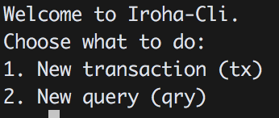

# Command Line Interface

Iroha Command Line Interface (CLI) is a tool for creation of transaction containing commands from the command line, or sending queries to Iroha. It is intended to simplify interaction between the client side and Iroha peer. 

Interactive mode of cli in a nutshell represents number of steps, where at each step user must interact with the system. 
To choose one of the options can type short name of the command specified in parentheses, or number of the command in the menu.

## Interactive mode 

Run: 
<code class="bash"> iroha-cli --interactive --name your_account_id </code>

Your account_id will be used as the creator of the queries and transactions, signing up messages with accounts keys, fill up counters. 
At the start of interactive cli will try to find locally keypairs associated with the account_id, hence this keypairs must be generated and stored locally. 

## Starting menu 

At the start of cli user has two possible modes:

* Start a transaction
* Start a query

## Transaction CLI

Start up of transaction cli will trigger the creation of a new transaction.
Each transaction consists of commands, being less or equal than **65000**. User is offered to add commands to new formed transaction.
All meta data of transaction will be filled automatically (signature, tx_counter, creator account, timestamp).
Currently following Iroha commands are supported in Interactive CLI:

Back option will switch back to main menu. 
To add command to transaction there two options:
<ol> 
    <li> Type number of the command in the menu, or command name without parameters: 
    This will iterate through the parameters of the command and ask user to type the parameter value. 
    For example typing "1" will create set account quorum, and ask to type account id and quorum: 
     </li> 

    <li> Type command name with all needed parameters . 
    This option can be used to quickly add command to transaction. For example typing: 
    `set_qrm test@test 2` - will create Set_Account_Quorum command for account: `test@test` and quorum: 2. </li> 
</ol>

After addition of the command, result menu will be printed:  

<ol>

    <li> User can add more commands to the same transaction </li>  
    <li> User can send to Iroha peer </li>
    <li> Go back and create new transaction (this will delete previous transaction) </li>
    <li> Save transaction as json file locally </li>
</ol>

## Query CLI

Interactive query cli is build similarly as Transaction CLI.
Query meta data will be assigned automatically (query_counter, time_stamp,  creator_account, signature)
Currently interactive cli supports the following queries:

For each query there two possible modes to run: 
<ol>
    <li> By typing appropriate number of query, either the corresponding abbreviation specified in parentheses. </li> 
    <li> Typing the command abbreviation with appropriated parameters. </li> 
</ol> 

After query is formed there are following options:
<ul> 
    <li>Save query as json </li>
    <li>Send to Iroha Peer and receive QueryResponse </li>
    <li>Back option, will return to query choice menu and remove current query. </li>
</ul>

