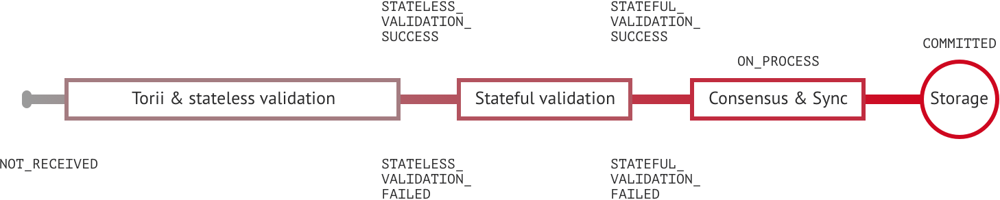

# Transactions

> Transaction 

```protobuf
message Transaction {
  Payload payload = 1;
  repeated Signature signature = 2;
 }
```
```json
{
    /* Transaction */
    "signatures": array of objects,
    "created_ts": int(13),
    "creator_account_id": string(?),
    "tx_counter": int,
    "commands": array of objects
}
```

A transaction is a state-changing set of actions in the system. When a transaction passes validation and consensus stages, it is written in a block and saved in immutable block store (blockchain). 

Transactions consist of commands, performing an action over an entity in the system. The entity might be an account, asset, etc. — more in [entity-relationship model](#er-model) page. 

<aside class="notice">
Iroha API follows command-query separation principle, which is described <a href="https://en.wikipedia.org/wiki/Command–query_separation">here</a>.
</aside>


Communication between Iroha peer and a client application is maintained via [gRPC framework](https://grpc.io/about/). 
Client applications should follow described protocol and form transactions accordingly to the description below.

## Transaction structure 

Each transaction consists of two parts:
<ul>
    <li> Payload </li> 
    <li> Signature </li> 
</ul>

> Payload

```protobuf
message Payload {
  repeated Command commands = 1;
  string creator_account_id = 2;
  uint64 tx_counter  = 3;
  uint64 created_time = 4;
}
```
```json
{
    "commands": [
        {
            "command_type": string(?),
            /* other command-specific fields */
        }
    ],
    "creator_account_id": string(?),
    "tx_counter": int,
    "created_ts": int(13)
}
```

> Signature 

```protobuf
message Signature {
   bytes pubkey    = 1;
   bytes signature = 2;
}
```
```json 
{
    "signatures": [
        {
            "pubkey": string(64),
            "signature": string(128),
        }
    ], …
}
```

**Payload** stores all transaction fields, except signatures: 
<ul>
    <li> Time of creation (unix time, in milliseconds) </li> 
    <li> Account ID of transaction creator (username@domain) </li>
    <li> Transaction counter. It counts how many times transaction creator sent transactions in total. Counter is used to prevent replay attack, and is formed on client side </li>
    <li> Repeated commands which are described in details in <a href="#commands">commands section</a> </li> 
</ul>

**Signatures** contain one or many signatures (ed25519 public key + signature):

<aside class="notice">
In the current version, there is no way to get current transaction counter by any means. You have to remember it on a client side and increment it. In a future version, this will be changed, and client application may retrieve this information.
</aside>

## Transaction statuses

The current version of Iroha peer follows client [pull principle](https://en.wikipedia.org/wiki/Pull_technology) for networking. It means that client should be proactive and request the state of a transaction from a peer. 

This section describes the set of states and matches them with transaction lifecycle.



 * `NOT_RECEIVED`: the peer does not have this transaction.
 * `STATELESS_VALIDATION_FAILED`: the transaction was formed with some fields, not meeting constraints. This status is returned to a client, who formed transaction, right after the transaction was sent. 
 * `STATELESS_VALIDATION_SUCCESS`: the transaction has successfully passed stateless validation. This status is returned to a client, who formed transaction, right after the transaction was sent. 
 * `STATEFUL_VALIDATION_FAILED`: the transaction has commands, which violate validation rules, checking state of the chain (e.g. asset balance, account permissions, etc.) 
 * `STATEFUL_VALIDATION_SUCCESS`: the transaction has successfully passed stateful validation.
 * `IN_PROGRESS`: the transaction was received, but not yet processed by stateless validator
 * `COMMITTED`: the transaction is the part of a block, which gained enough votes and is in the block store at the moment. 